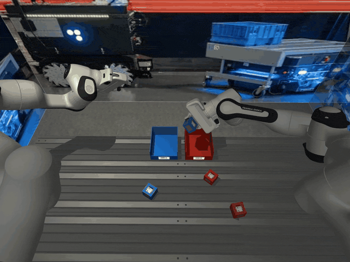
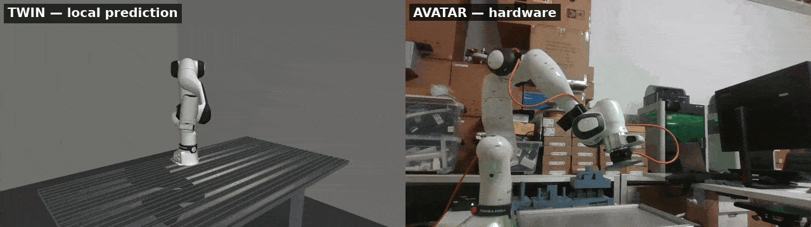
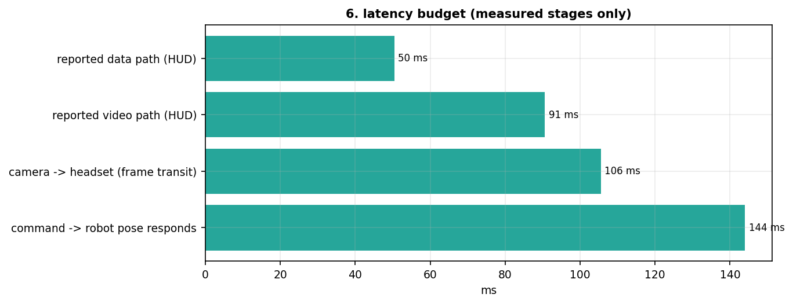

# Teleoperation Avatar

Robot-side C++ backend for the bimanual teleoperation system. It receives operator commands from the [VR interface](https://github.com/AlexanderWegenerRobotics/teleop-vr-interface), runs a per-device state machine and control loop for each arm, head and gripper, streams stereo video back over RTP/H.264, and records synchronised episodes for policy training. The same binary drives a MuJoCo simulation or a real Franka arm — the backend is a build flag, and a second instance of it runs locally as a predictive twin.



<sub>The avatar's head camera during a data-collection run — the same frames that get timestamped, encoded and streamed to the operator.</sub>

> **Status: active development.** Simulation and hardware backends both run; the system has been operated cross-continentally and used for demonstration collection.

---

## What this does

Two processes launch together and are deliberately decoupled: the **control process** (`avatar`) and the **video/data pipeline** (`avatar_pipeline`). The pipeline reads frames from shared memory regardless of what the control loop is doing, and the control loop runs regardless of stream health.

The control process builds the scene from config, starts a control thread per device, and runs an avatar-level state machine above the per-device ones. Each arm runs a 200 Hz state machine over a 1 kHz control loop, switching between joint-position and Cartesian impedance control depending on state. MuJoCo steps at 1 kHz to match the real Panda; forward kinematics come from Pinocchio. A device that faults is detached and the rest keep running — a fault is a state, not an exception.

The pipeline process renders or captures the configured cameras into shared memory, packs the stereo pair into one frame, embeds a 64-bit wall-clock timestamp in an extra image row, and streams over RTP/H.264 with FEC. Because both machines are NTP-disciplined, the receiver measures true one-way delay at decode time rather than assuming half a round trip. A quality controller adapts bitrate, frame rate and FEC from receiver feedback so the link degrades instead of stalling.

---

## Architecture


### Control

Each arm runs Cartesian impedance in a 1 kHz torque loop — a stiffness/damping wrench on the pose error mapped through the Jacobian transpose, with posture regulated in the nullspace so the elbow can settle without moving the hand. A second mode tracks a joint reference through resolved-rate IK instead. Between the operator's pose command and the controller sits a motion generator with per-joint velocity and acceleration caps and a braking horizon that decelerates a joint before its limit rather than clipping at it; homing and recovery run on smooth profiles rather than step commands.

The pan-tilt head follows the headset under joint impedance with torque rate limiting, driven either in MuJoCo or through the hardware driver. Grippers report width and a confirmed grasp state back to the operator, using a tolerance and hold time set in config.

### Two arms in one workspace

A control-barrier-function filter sits between the commanded Cartesian velocity and the executed one, with a margin that grows with closing speed. When a command would breach it, the filter solves a one-constraint QP in closed form; radial motion is penalised more than tangential, so the correction slides an arm around its neighbour instead of stopping it dead. Each arm optionally runs a constant-velocity Kalman filter on the other's end-effector so the margin tracks where the other arm is going, and widens when that estimate is least certain.

### One codebase, two backends

The MuJoCo backend mirrors the libfranka state space exactly — joint positions, velocities, external torques, Cartesian pose — so the control and networking code does not know which one it is talking to. Scenes, devices, gains and workspace limits are YAML, assembled into a model at startup, so adding an arm is a config change rather than a rebuild.

Alongside the operator channel, each arm exposes a second command port carrying absolute world-frame poses with no VR origin semantics, so an autonomous controller can drive the same loop through the same message struct the operator uses.

---

## The predictive twin

Across a long link the video feed is the slowest thing the operator sees, and every input is judged against a picture of the past. The fix is not a faster picture — it is to stop making the operator wait for it.



<sub>Left: the twin, a local instance running on a simulated plant. Right: the hardware. Separate camera viewpoints, same command stream.</sub>

Because the backends are interchangeable, a second instance of this identical stack runs locally on a simulated plant. **One binary, two roles** — `role:` in `config.yaml` selects `avatar` or `twin`, which governs which config subtree loads and whether a reconciler is constructed. The twin sees every command the moment the operator issues it; the hardware sees it one forward delay later.

Prediction drifts, so the twin is corrected against delayed hardware telemetry. The avatar forwards joint state at 100 Hz; the twin's **reconciler** replays its own buffered state and applied control forward through a private headless `mjData` to the same instant, and pulls the prediction toward the corrected estimate through a filtered gain rather than snapping it:

| Regime | Innovation ‖q_twin − q_avatar‖ | Behaviour |
|---|---|---|
| Soft | below ~2° | correction dissolves into the servo, no visible jump |
| Hard | above ~10° | hard resync and a UI cue — the model broke (contact, e-stop, joint limit) |

A staleness guard drops corrections older than 50 ms, so a stalled reconciler thread degrades to open-loop prediction instead of applying ancient corrections.

---

## Data collection

Episodes are the unit of collection, and both processes agree on their boundaries: the control process emits episode start/end over UDP, and the pipeline opens and closes per-camera recordings in sync. An episode config server can randomise object spawns per episode and hand the full scene configuration back, so a collection session varies without hand-editing YAML.

Each episode folder under `logs/NNN/` holds per-device telemetry (`arm_left.csv`, `arm_right.csv`, `head.csv`, `scene.csv`, each with a `_meta` sidecar carrying episode configuration and outcome), plus one raw H.264 elementary stream per camera with a per-frame timestamp sidecar.

Video and telemetry run at different, uneven rates, so conversion aligns them by wall clock onto a fixed-rate master timeline:

| Script | Purpose |
|---|---|
| `episode_to_hdf5.py` | Build one synchronised training HDF5 from an episode folder |
| `validate_episode.py` | Pre-collection gate: assert acceptance criteria on a converted episode |
| `inspect_episode.py` | Quick HDF5 inspector |
| `episode_video_to_mp4.py` | Remux an episode's H.264 to MP4; can split stereo and crop timestamp markers |
| `analyze_latency.py` | Capture-to-encode latency from the timestamp sidecars |
| `episode_config_server.py` | Randomised per-episode object spawns over msgpack/UDP |

Notebooks for reading and plotting sessions live in `analysis/`.

---

## Measured

From one desk-hardware session, operator and avatar on separate machines:



| | |
|---|---|
| Command channel | 50 ms, steady at 200 Hz |
| Video path, reported | 91 ms median |
| Camera → headset, frame transit | 106 ms median |
| Video jitter | 0.08 ms median |
| Packet loss | effectively zero over the session |

The first three bars are direct measurements against a common NTP-disciplined clock. The fourth — command to robot pose responding — is a cross-correlation estimate and should be read as an order of magnitude, not a figure. This is one session on a desk setup, not a benchmark.

---

## Building

### Prerequisites

MuJoCo, Pinocchio, Eigen3, yaml-cpp, msgpack-cxx and Poco are required. GStreamer is needed for the pipeline binary, libfranka only for hardware builds, and the Intel RealSense SDK only if you want a camera source other than MuJoCo.

### Options

| Flag | Default | Effect |
|---|---|---|
| `BUILD_WITH_MUJOCO` | `ON` | MuJoCo simulation backend — no hardware required |
| `BUILD_WITH_FRANKA` | `OFF` | Real Franka arm via libfranka |
| `BUILD_STREAMER` | `ON` (`OFF` on Windows) | Build the `avatar_pipeline` binary |
| `BUILD_WITH_REALSENSE` | `OFF` | RealSense camera source |
| `BUILD_WITH_TESTS` | `ON` | Test targets |

### Configure and build

```bash
git clone https://github.com/AlexanderWegenerRobotics/teleop-avatar.git
cd teleop-avatar && mkdir build && cd build

# simulation only — no hardware needed
cmake .. -DBUILD_WITH_MUJOCO=ON -DBUILD_WITH_FRANKA=OFF \
         -DMUJOCO_ROOT=/path/to/mujoco -DCMAKE_PREFIX_PATH=/opt/openrobots

# real Franka hardware
cmake .. -DBUILD_WITH_MUJOCO=OFF -DBUILD_WITH_FRANKA=ON

cmake --build . --config Release -j
```

This produces `avatar` and, unless the pipeline is disabled, `avatar_pipeline`.

---

## Running

```bash
./launch.sh              # role from config.yaml
./launch.sh --twin       # force twin role
./launch.sh --avatar     # force avatar role
```

`launch.sh` finds the binaries, starts both, and shuts both down cleanly on Ctrl+C. To run them separately for debugging, launch `./avatar` and `./avatar_pipeline` from the build directory — both accept the same role flag.

With `BUILD_WITH_MUJOCO=ON` and no VR interface running, the avatar starts, builds the scene and idles waiting for commands, so the scene, control loops and logging can all be exercised without a robot or a headset.

### Networking and clock sync

Avatar and operator connect over ZeroTier; addresses and ports live in the robot and pipeline configs. One-way latency measurement is only meaningful with synchronised clocks — run NTP (or chrony) on both machines and verify sync before trusting any latency number.

---

## Configuration

`config/config.yaml` is a small index: a `role:` key plus one subtree per role naming the files that role should load.

```yaml
role: avatar

avatar_config:
  sim_config:      "../config/sim_config_franka_desk.yaml"
  robot_config:    "../config/robot_config_desk_remote.yaml"
  streamer_config: "../config/pipeline_config_desk_remote.yaml"
```

| File | Governs |
|---|---|
| `robot_config_*` | Devices, transmission ports, control gains, workspace limits, self-collision, twin telemetry, grasp confirmation |
| `sim_config_*` | MuJoCo scene: timestep, cameras, static/dynamic/visual/mocap objects |
| `pipeline_config_*` | Stereo mode, stream resolution and rate, camera channels, quality ladder, episode listener port |
| `reconciler_config` | Twin only: correction time constant, innovation thresholds, buffer horizon, staleness guard |
| `*_overlay` | Twin only: sparse overrides applied on top of the avatar's transmission and pipeline configs |

Scenario variants sit beside each other (`_avatar`, `_local`, `_desk_local`, `_desk_remote`, `_twin_*`), and switching scenario is an edit to the index rather than a diff across every file. Task definitions live in `config/tasks/`. Every config file carries inline comments on the non-obvious values — those comments are the reference, not this table.

---

## Repository layout

```
src/ , include/          C++ sources; include/ mirrors src/
  sim_env/               MuJoCo backend, scene builder, robot/gripper/head drivers
  network/               UDP transport, per-device streams, reliable ACK channel
  pipeline/              Camera sources, shared memory, streaming, quality control,
                         episode control, video logging
  twin/                  Role selection, ring buffer, reconciler, mailbox, telemetry
  intention/             Operator-intent sampling and per-episode annotation logs
config/                  Scenario configs and task definitions
models/                  MuJoCo MJCF (Franka FR3/Panda, pan-tilt, Allegro, props) and URDF
scripts/                 Episode conversion, validation, inspection, latency analysis
analysis/                Notebooks and plotting utilities
tests/                   Command injection, stream quality, transport tests
launch.sh                Start both processes together
```

---

## Logging

Alongside per-episode folders, a running session writes continuous per-device CSVs to `log/`: joint positions, velocities, external torques, end-effector pose, control mode and state at control rate, with `_meta` files marking episode boundaries and outcomes.

---

## License

Apache License 2.0 — see [LICENSE](LICENSE).

## Contact

Alexander Wegener — [Alexander_wegener1998@yahoo.de](mailto:Alexander_wegener1998@yahoo.de)
